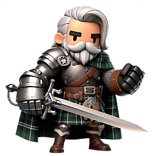

 
# KnightHyde 

[[🡅 up to Index](./0-Pages.md)] [[🡄 back: Gems](./6-monsters.md)] [[🡆 next: Gauntlets](./8-gear.md)]

---
---

## VII. Gauntlets

Bounties and Roaming Monsters are an absolutely critical source of gear and resources.

---

### A. **Bounties**

* Bounties are mini-quests where you have to kill multiple Roaming Monsters (next section) to redeem the Bounty reward. 
* You can do 7 Bounties per week
* You can **re-roll* Bounty rewards with 5 gems (per re-roll)
   * Early game it isn't going to be worth it to re-roll your rewards
   * When you get to the Mythic gear grind, re-rolling with gems can save you days of work if you manage to get the right Blue or Purple reward to show up with the re-roll
   * If you are going to re-roll to look for a specific reward, re-roll a bounty that has nothing you really need ... as you may not get a good re-roll and not want to keep spending gems

---

### B. **Roaming Monsters**

Roaming Monsters are a decent source of resources and lower tier (grey/green). They will spawn in specific zones (like Mirefen, etc) and move around the map. They are only available for a limited time.
   * 20 minutes for most
   * 30 minutes for elite spawns
   * 10 hours for boss spawns

You can see the possible items a monster will drop by clicking on their chest when viewing the screen to start an encounter. *This is most useful when you need to farm specific items for Mythic gear*.

1. **Quick Tips:** 
   * If you see a boss spawn that you really want to kill for a chance at specific gear gear, **but don't have enough stamina**, you can set a phone timer for later on. BUT ...
   * If you see a boss spawn that has **resources** you want (specific tomes, gauntlet cores, drops, etc) ... **don't wait** ... these rewards will change randomly through the timer (maybe once per hour?)
   * Monsters actually DO "roam" on the map they spawn in
      * If you have that entire map unlocked they will appear in the list until their timer is up
      * If you do NOT have the entire map for the monster's zone unlocked
         * Monsters may temporarily disappear from your list when they "roam" into areas you haven't explored
         * *As long as their timer isn't expired, they may roam back to an area you can see* ***and appear in your list again***
   * The stamina cost of a Roaming Monster fight is dictated by the combination of bonus objective rewards and possible loot in the monster's chest

2. **Chests:**

   All Roaming Monsters except for Event special monsters drop a chest if you win

   * These contain armor and weapons
   * The higher level zone the monster is in will increase the rarity of the gear dropped
   * **You can see what might be in the chest by clicking on it on the "Prepare" screen**
      * This doesn't matter much early on, but once you need a specific piece to either forge or sacrifice, doing this can help you save stamina for the right fight

   Event special monsters will instead reward some Event points when killed. 

   If you finish the final reward tier of an Event, a special boss (Lost Knight) begins roaming. When killed he drops an **Event Chest**, giving a way to get more of these without spending gems. 

3. Bonus Objectives

   * Every Roaming Monster has 3 bonus objectives that require you to use specific gear/hero/actions to complete
   * If you complete all 3 when the monster dies, you get a 4th bonus awarded
      * This is the primary way of getting Customization Chests for farming extra gold (see [IV. Chests](./4-chests.md))
      * Some objectives will be impossible due to requiring gear or a hero that you don't have
      * Objective rewards can include Torches and Arena Tickets, in case you need more before the next refresh
      * Higher level monsters will drop more resources as Objective bonus rewards (example: if you see a low level monster a might higher level monster with a "Dark Tome", the high level monster is going to drop more Tomes)
   * **Once you get to mid game it can be hard to complete some objectives on low level monsters** (because you kill too fast)
      * Keep a set of low level weapons and use them on these fights so you can power up Heroes and Rage
      * Those low level weapons can also help you whittle a mob down to very low health to then kill it with an under-ranked Hero if needed for an objective

---
---

Knighthyde - [[🡅 up to Index](./0-Pages.md)] [[🡄 back: Gems](./6-monsters.md)] [[🡆 next: Gauntlets](./8-gear.md)]